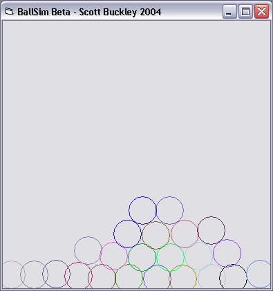



## ^ Ballsim Beta

### Description

CHECK THIS OUT. This very simple prog uses (relativley) basic trig to simulate balls rolling over each other on a 2d plane. it uses ditances between centres to detect collision. A new ball is added when you click in the middle of the screen.

Please vote if you liked it, and feel free to suggest... suggestions.
 
### More Info
 

             |
---                |---
**Submitted On**   |2004-07-03 20:59:14
**By**             |[Scott Buckley](https://github.com/Planet-Source-Code/PSCIndex/blob/master/ByAuthor/scott-buckley.md)
**Level**          |Intermediate
**User Rating**    |4.8 (19 globes from 4 users)
**Compatibility**  |VB 6\.0
**Category**       |[Miscellaneous](https://github.com/Planet-Source-Code/PSCIndex/blob/master/ByCategory/miscellaneous__1-1.md)
**World**          |[Visual Basic](https://github.com/Planet-Source-Code/PSCIndex/blob/master/ByWorld/visual-basic.md)
**Archive File**   |[^\_Ballsim\_176739782004\.zip](https://github.com/Planet-Source-Code/scott-buckley-ballsim-beta__1-54821/archive/master.zip)

